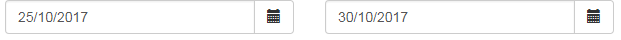

[](https://travis-ci.org/guicmachado/angular-componentes-exemplo)

# angular-componentes-exemplo
Exemplo de criação de componentes usando AngularJS.

## Configuração

### Pré-requisito
Node 6 ou superior.
Yarn 1.2 ou superior.

### Baixando as dependências
```
yarn install
```

### Iniciar o servidor
```
yarn start
```

### Aplicação de demonstração

http://localhost:8080

### Execução dos testes unitários
```
yarn test
```

### Execução dos testes End-to-End
```
yarn run protractor
```

## Componentes

periodoCalendario - baseado no calendário do [UI Bootstrap](https://angular-ui.github.io/bootstrap/):



### Utilização

* Sem informar o período inicial (atribui a data atual):
```
<periodo-calendario></periodo-calendario>
```

* Com período informado:
```
<periodo-calendario inicio="periodoDemo.inicio" fim="periodoDemo.fim"></periodo-calendario>
```

Para mais detalhes verificar o código do aplicativo de demonstração - [Demo](src/app/demonstracao/index.ejs).